  <a href="https://michaelbaffourawuah.com">
    <picture>
      <source media="(prefers-color-scheme: light)" srcset="./assets/profile-light.svg">
      
    </picture>
  </a>

  <a href="https://michaelbaffourawuah.com"><strong>Explore my portfolio ↗</strong></a> &nbsp;·&nbsp;
  <a href="mailto:michaelbaffourawuah708@gmail.com">Email</a> &nbsp;·&nbsp;
  <a href="https://navox.net">Try NavoX ↗</a>

I'm **Michael**, a **Cornell Engineering** student building AI/ML systems and useful software—from deep-learning internals to deployed products.

Previously a **Microsoft Software Engineer Intern**, working on AI observability and agent evaluation.

### Selected work

| Project | In brief |
| --- | --- |
| **[NavoX](https://github.com/michaelbawuah/NavoX)** | Personal AI assistant with voice, connected accounts, a Chrome side panel, and OpenAI, Claude, and Gemini adapters. |
| **[Fluxion](https://github.com/michaelbawuah/Fluxion)** | Deep-learning engine from scratch: tensors, autograd, transformers, and native C++/BLAS operators. |
| **[ModelForge](https://github.com/michaelbawuah/ModelForge)** | Model registry and inference platform with versioned artifacts, progressive releases, and rollback. |
| **[ToolRet](https://github.com/michaelbawuah/toolret-hybrid-retrieval)** | Retrieval research on when to rerank, evaluated over 37,292 tools. |
| **[MarketLab](https://github.com/michaelbawuah/MarketLab)** | Portfolio planning and reproducible backtests with exact accounting and independent verification. |

**Working with:** `Python` · `C/C++` · `TypeScript` · `Java` · `Go` · `SQL` · `PyTorch` · `Docker`
